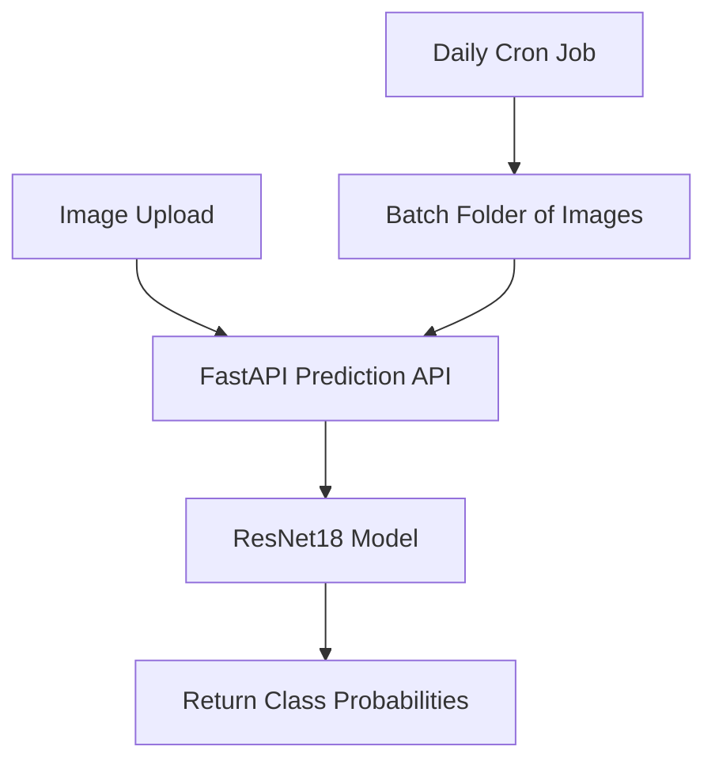
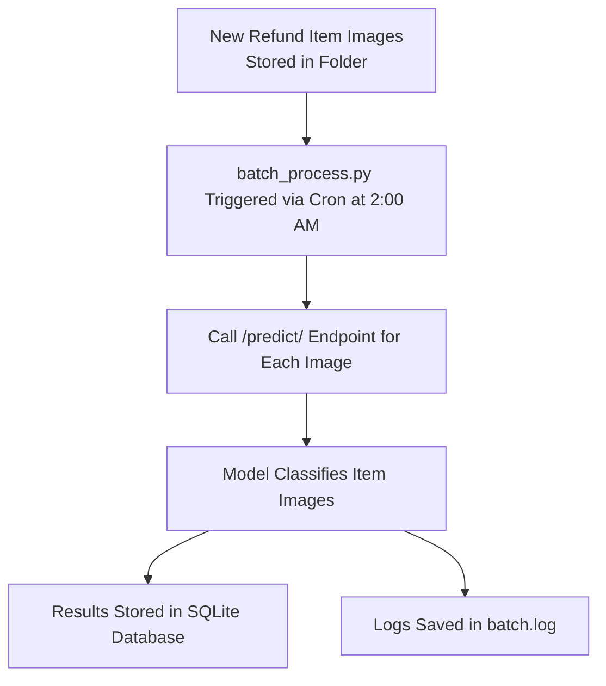

# 🛒 Refund Item Classification System

## 📌 Overview
This project automates the classification of refund items using a **Deep Learning model**. It is designed to reduce manual effort by categorizing refund items based on images.

The system:
✅ Accepts images via **FastAPI**  
✅ Classifies refund items using a **pre-trained PyTorch model**  
✅ Automates batch processing using **cron jobs** inside Docker  
✅ Runs efficiently with **Docker Compose**  

---

## 🚀 Tech Stack
- **Python 3.12** (Alpine-based Docker)
- **PyTorch** (for deep learning inference)
- **FastAPI** (for API service)
- **Docker & Docker Compose** (for deployment)
- **SQLite** (for batch processing storage)
- **Cron Jobs** (for automation)

---

## 📊 Model Info
- **🔍 Architecture:** ResNet-18 (pretrained on ImageNet)
- **🏷️ Classes:** 27 fashion categories
- **🔁 Augmentation:** flipping, rotation, brightness
- **📈 Accuracy:** ~81% on validation set

---

## 🚀 Architecture Diagram



---

## 📂 Project Structure
```
refund-classifier/
├── app/                           # Main application directory
│   ├── test_images/               
│   ├── model/                     # Model storage
│   │   ├── model_scripted.pt       # Pre-trained PyTorch model
│   ├── scripts/                    # Utility scripts
│   │   ├── data_loader.py          # Data handling & preprocessing
│   ├── main.py                     # FastAPI application
│   ├── model_utils.py              # Model inference & processing
│   ├── batch_process.py            # Batch job script
    ├── logs/                           # Logs for debugging
    │   ├── app.log                      # API logs
    │   ├── batch.log                    # Batch processing logs
├── config/                         # Configuration files
│   ├── crontab                     # Cron job configuration
├── database/                       # Storage for batch results
│   ├── prediction.db                # SQLite database
├── Dockerfile                      # Docker setup
├── .gitignore                       # Ignored files
├── README.md                        # Documentation
├── requirements.txt                  # Python dependencies
├── docker-compose.yml                # Docker Compose setup
```

---

## 📸 API Demo
The API can classify images using `POST /predict/`.

### **Example Request**:
```bash
curl -X 'POST' 'http://127.0.0.1:8000/predict/' \
  -H 'accept: application/json' \
  -H 'Content-Type: multipart/form-data' \
  -F 'file=@test_images/sample.jpg'
```

### **Example Response**:
```json
{
  "predicted_class": "Socks",
  "confidence": 0.91
}
```

---

## ⏳ Batch Processing (Cron Jobs)
Batch processing **runs automatically** every night at **2 AM** via a cron job inside Docker.

### **Manually Run Batch Processing:**
```bash
docker exec -it refund_classifier python /app/app/batch_process.py
```

### **Check Logs for Batch Predictions:**
```bash
docker exec -it refund_classifier cat /app/app/logs/batch.log
```

### 🚀 Batch Processing Diagram


---

## 🛠️ Setup & Installation

### **1️⃣ Clone Repository**
```bash
git clone https://github.com/gulomovazukhrakhon/refund-classifier.git
cd refund-classifier
```

### **2️⃣ Install Dependencies (For Local Setup)**
```bash
pip install -r requirements.txt
```

### **3️⃣ Run FastAPI Locally**
```bash
uvicorn app.main:app --host 0.0.0.0 --port 8000 --reload
```

### **4️⃣ Run With Docker**
```bash
docker-compose up --build -d
```

```bash
# Pull from Docker Hub
docker pull zukhrakhon/refund-classifier:latest

# Create a Container
docker run -p 8000:8000 zukhrakhon/refund-classifier:latest
```

### **5️⃣ Test API Endpoint**
```bash
curl -X 'POST' 'http://127.0.0.1:8000/predict/' \
  -H 'accept: application/json' \
  -H 'Content-Type: multipart/form-data' \
  -F 'file=@test_images/sample.jpg'
```

---

## 📎 Related Links
- 📂 Kaggle Notebook: https://www.kaggle.com/code/zukhrakhongulomova/automated-refund-item-classification-system 
- 💻 GitHub Repository: https://github.com/gulomovazukhrakhon/refund-classifier
- 🐳 Docker Image: https://hub.docker.com/r/zukhrakhon/refund-classifier

---

## 🔥 Next Steps
- **Improve model accuracy**
- **Add a frontend (Streamlit/Gradio)**
- **Optimize Docker image size further**

---
## 📢 Contributing
Pull requests are welcome. For major changes, please open an issue first to discuss.

---

## 📄 License
This project is licensed under the MIT License.
